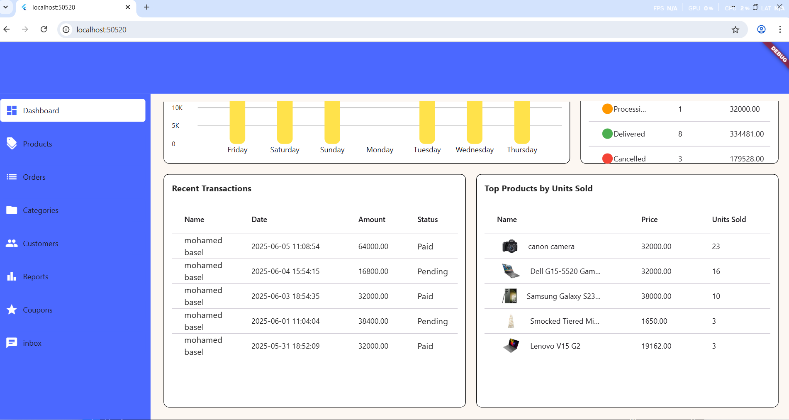

# ecommerce_admin_panel

## Features

### weekly analyzing data

- **orders per day progress**: charts for the amount of orders on the past 7 days.
- **Orders status**: information about the orders' status to take action.
- **top products**: information about the favorite sold items .
 
### Orders Control

- **accepting and pereparing orders**: accepting and preparing orders and sending notifications for the users.

### products & categories Control

- **Effortless Product Control**: Easily add, edit, and update product details, including descriptions, pricing, and high-quality images..
- **Effortless Categories Control**: Easily add, edit, and update categories .

### Customers caring

- **top customers**: showing the top customers related to spending on the ecommerce.
- **customers feedback**: showing customers'feedback about our services.

## Screenshots

<table>
  <tr>
    <td></td>
    
  </tr>
 <tr>
    <td></td>
   <td></td>
  </tr>
  </table>
